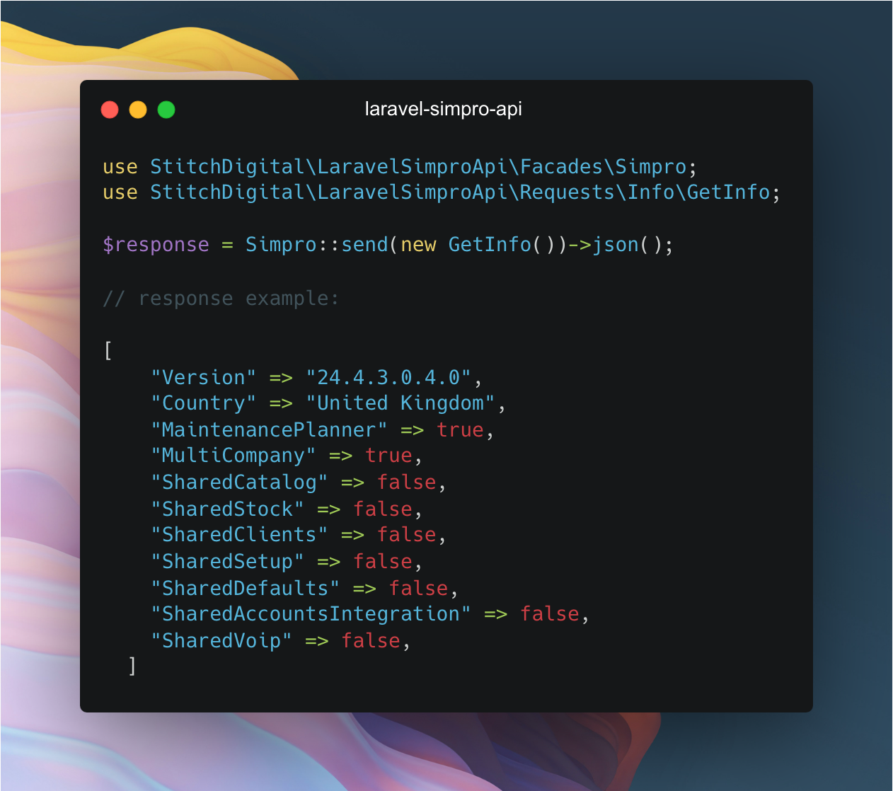

# Laravel package for working with the Simpro API

[](https://packagist.org/packages/stitch-digital/laravel-simpro-api)
[](https://github.com/stitch-digital/laravel-simpro-api/actions?query=workflow%3Arun-tests+branch%3Amain)
[](https://github.com/stitch-digital/laravel-simpro-api/actions?query=workflow%3A"Fix+PHP+code+style+issues"+branch%3Amain)
[](https://packagist.org/packages/stitch-digital/laravel-simpro-api)



Laravel Simpro is a robust package designed to seamlessly integrate your Laravel application with the Simpro API.

The full Simpro API documentation can be [found here](https://developer.simprogroup.com/apidoc/).

# Table of Contents
- [Installation](#installation)
- [Usage](#usage)
  - [Using a Single Simpro Connection](#using-a-single-simpro-connection)
  - [Using Multiple Simpro Connections](#using-multiple-simpro-connections)
- [Available Requests](#available-requests)
- [Useful Methods](#useful-methods)
  - [Responses](#responses)
  - [Pagination](#pagination)
  - [Rate Limiting](#rate-limiting)
  - [Caching](#caching)
  - [Retries](#retries)
  - [Query Parameters](#query-parameters)
- [Changelog](#changelog)
- [Contributing](#contributing)
- [Security](#security)
- [Credits](#credits)
- [License](#license)

# Installation

Laravel Simpro API can be installed using composer:

```bash
composer require stitch-digital/laravel-simpro-api
```

Then publish the config file:

```bash
php artisan vendor:publish --tag="simpro-api-config"
```

This will publish the configuration file to `config/simpro-api.php` where you can configure your settings.

This package is built using Saloon. Check out their [documentation here](https://docs.saloon.dev/).

# Usage

### Using a Single Simpro Connection
If you are using a single Simpro connection, you can add the following environment variables to your `.env` file:

```bash
SIMPRO_BASE_URL=https://your-build-url.simprosuite.com
SIMPRO_API_KEY=your-api-key
```

To use the package, you can use the Simpro facade to make requests to the API:

```php
use StitchDigital\LaravelSimproApi\Facades\Simpro;
use StitchDigital\LaravelSimproApi\Requests\Info\GetInfo;

$response = Simpro::send(new GetInfo())->json();
```

If you prefer to use dependency injection over facades then you can do this too:

```php
use StitchDigital\LaravelSimproApi\LaravelSimproApi;
use StitchDigital\LaravelSimproApi\Requests\Info\GetInfo;

$connector = new new LaravelSimproApi();
$request = new GetInfo();

$response = $connector->send($request)->json();
```

### Using Multiple Simpro Connections
If you are using multiple Simpro connections, you can pass the base URL and API key to the constructor of the connector:

```php
use StitchDigital\LaravelSimproApi\LaravelSimproApi;
use StitchDigital\LaravelSimproApi\Requests\Info\GetInfo;

$connector = new LaravelSimproApi(
    baseUrl: 'https://custom-api-url.simprosuite.com',
    apiKey: 'custom-api-key'
);

$response = $connector->send(new GetInfo());

$response->json();
```

## Available Requests

For a full list of available requests, use the following command:

```bash
php artisan simpro:list-requests
```

## Useful Methods

### Responses

After sending a request to the Simpro API, a <code>Response</code> class is returned. In most of the examples, we show the json method that returns a JSON response body. Below are some of the key methods provided by Saloon's <code>Response</code> class:

<table><thead><tr><th width="342">Method</th><th>Description</th></tr></thead><tbody><tr><td><code>status</code></td><td>Returns the response status code.</td></tr><tr><td><code>headers</code></td><td>Returns all response headers</td></tr><tr><td><code>header</code></td><td>Returns a given header</td></tr><tr><td><code>body</code></td><td>Returns the raw response body as a string</td></tr><tr><td><code>json</code></td><td>Retrieves a JSON response body and json_decodes it into an array.</td></tr><tr><td><code>array</code></td><td>Alias of <code>json</code></td></tr><tr><td><code>collect</code></td><td>Retrieves a JSON response body and json_decodes it into a Laravel Collection. Requires <code>illuminate/collections</code>.</td></tr><tr><td><code>object</code></td><td>Retrieves a JSON response body and json_decodes it into an object.</td></tr><tr><td><code>xmlReader</code></td><td>Used for XML responses - returns a XML Wrangler reader. Requires <code>saloonphp/xml-wrangler</code>.</td></tr><tr><td><code>dom</code></td><td>Used for HTML responses - returns a <a href="https://symfony.com/doc/current/components/dom_crawler.html">Symfony DOM Crawler</a> instance. Requires <code>symfony/dom-crawler</code>.</td></tr><tr><td><code>stream</code></td><td>Returns the response body as an instance of <code>StreamInterface</code></td></tr><tr><td><code>saveBodyToFile</code></td><td>Allows you to save the raw body to a file or open file resource.</td></tr><tr><td><code>dto</code></td><td>Converts the response into a data-transfer object.</td></tr><tr><td><code>dtoOrFail</code></td><td>Will work just like <code>dto</code> but will throw an exception if the response is considered "failed".</td></tr><tr><td><code>ok</code>, <code>successful</code>, <code>redirect</code>, <code>failed</code>, <code>clientError</code>, <code>serverError</code></td><td>Methods used to determine if a request was successful or not based on status code. The <code>failed</code> method can be customised.</td></tr><tr><td><code>throw</code></td><td>Will throw an exception if the response is considered "failed".</td></tr><tr><td><code>getPendingRequest</code></td><td>Returns the <code>PendingRequest</code> class that was built up for the request.</td></tr><tr><td><code>getPsrRequest</code></td><td>Returns the PSR-7 request that was built up by Saloon</td></tr><tr><td><code>getPsrResponse</code></td><td>Return the PSR-7 response that was built up by the HTTP client/sender.</td></tr></tbody></table>


### Pagination

This package uses the [Saloon Paged Paginator](https://docs.saloon.dev/installable-plugins/pagination/paged-pagination) for all GET requests that return multiple results.

There are various ways to use the paginator, all well documented in the Saloon docs - here is an example:

Let's say we want to retrieve all customers from Simpro. We can use the 'GetCustomers' request:

```php
use StitchDigital\LaravelSimproApi\Facades\Simpro;
use StitchDigital\LaravelSimproApi\Requests\Customers\GetCustomers;

$companyId = 0;
$response = Simpro::send(new GetCustomers($companyId))->json();
```

However, Simpro will paginate responses by default to a page size of 30 results. We can see this if we return the headers for the same request:

```php
use StitchDigital\LaravelSimproApi\Facades\Simpro;
use StitchDigital\LaravelSimproApi\Requests\Customers\GetCustomers;

$companyId = 0;
$response = Simpro::send(new GetCustomers($companyId))->headers();
```

This will return pagination data in the headers:

```php
[
    "Result-Total" => "816",
    "Result-Pages" => "28",
    "Result-Count" => "30",
]
```

The easiest way to use the paginator is to collect all responses like this:

```php
use StitchDigital\LaravelSimproApi\Facades\Simpro;
use StitchDigital\LaravelSimproApi\Requests\Customers\GetCustomers;

$companyId = 0;
$response = Simpro::paginate(new GetCustomers($companyId))
  ->collect()
  ->all();
```

### Rate Limiting

This package uses the [Saloon Rate Limiter Plugin](https://docs.saloon.dev/installable-plugins/handling-rate-limits) to rate limit requests to the Simpro API.

You can disable rate limited globally in the config file, as well as set the rate limit, threshold and driver:

```php
    /*
    |--------------------------------------------------------------------------
    | Rate Limit Configuration
    |--------------------------------------------------------------------------
    |
    | Set the rate limit for Simpro requests. The rate limit is set per second
    | and the threshold is the percentage of the rate limit that is accepted.
    | The threshold must be a number between 0 and 1 (e.g. 0.5 for 50%).
    |
    | The default rate limit is as per the Simpro API documentation.
    |
    */

    'rate_limit' => [
        'enabled' => true,
        'per_second' => 10,
        'driver' => 'database',
        'threshold' => 0.8,
    ],
```

You can also disable rate limiting on a per-request basis by chaining the `useRateLimitPlugin(false)` method to the request:

```php
use StitchDigital\LaravelSimproApi\Facades\Simpro;
use StitchDigital\LaravelSimproApi\Requests\Info\GetInfo;

$response = Simpro::useRateLimitPlugin(false)
  ->send(new GetInfo())
  ->json();
```

### Caching

This package uses the [Saloon Caching Plugin](https://docs.saloon.dev/installable-plugins/caching-responses) to cache GET requests to the Simpro API.

You can disable caching globally in the config file, as well as set the cache driver and expiry time:

```php
    /*
    |--------------------------------------------------------------------------
    | Cache Configuration
    |--------------------------------------------------------------------------
    |
    | Enable or disable caching for Simpro GET requests. The cache driver can
    | be set to any of the Laravel cache drivers. The cache expiry time is
    | set in seconds.
    |
    */

    'cache' => [
        'enabled' => true,
        'driver' => 'database',
        'expire' => 120,
    ],
```

### Retries

You can control the global retry configuration in the config file:

```php
    /*
    |--------------------------------------------------------------------------
    | Global Retry Configuration
    |--------------------------------------------------------------------------
    |
    | Set the number of retries for all requests. This can still be overridden
    | on a per-request basis, by chaining sendAndRetry() to the request:
    |
    | Example:
    | $response = $connector->sendAndRetry($request, 1);
    |
    */

    'global_retries' => 3, // Set to null to disable global retries
```

### Query Parameters

You can add query parameters to your requests by chaining the `query` method to the request:

```php
use StitchDigital\LaravelSimproApi\Facades\Simpro;
use StitchDigital\LaravelSimproApi\Requests\Jobs\GetJobs;

$companyId = 0;
$siteId = 123;

$request = new GetJobs($companyId);
$request->query()->add('Site.ID', $siteId);

// Returns all jobs for Site ID 123
$response = Simpro::send($request)->json();
```

# Changelog

Please see [CHANGELOG](CHANGELOG.md) for more information what has changed recently.

# Contributing

Contributions are welcome and will be fully credited! Contributions are accepted via Pull Requests on [GitHub](https://github.com/stitch-digital/laravel-simpro-api).

# Security

If you discover any security related issues, please email john@stitch-digital.co instead of using the issue tracker.

# Credits

-   [John Trickett](https://github.com/johntrickett86)
-   [Anthony Elleray](https://github.com/AElleray)
-   [Sam Carré](https://github.com/Sammyjo20) - The Creator of Saloon
-   [All Contributors](https://github.com/stitch-digital/laravel-simpro-api/contributors)

# License

The MIT License (MIT). Please see [License File](LICENSE.md) for more information.
