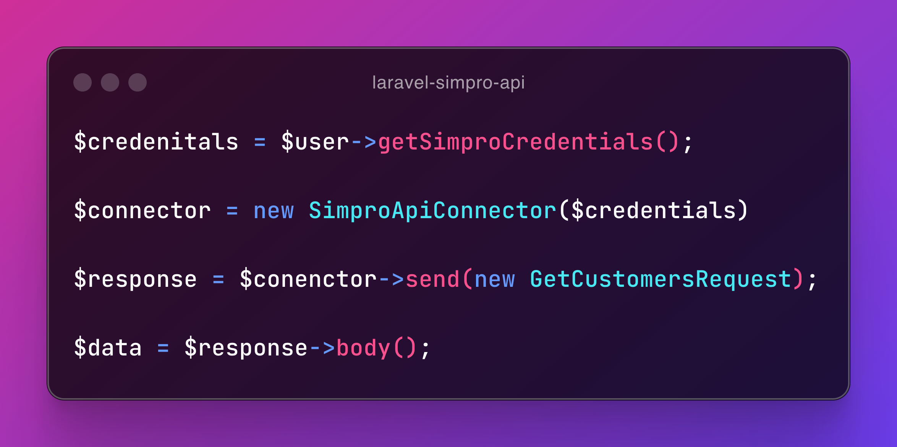

# Introduction

Laravel Simpro API provides an SDK for working with the Simpro API in Laravel, powered by [Saloon](https://docs.saloon.dev/).

<figure><figcaption>
Powered by Saloon
</figcaption></figure>

## Key Features

* Support for API Key Authorisation
* Support for Authorization Code Grant OAuth2
* Multi-tenancy support
* Rate limit protection to ensure adherence with Simpro's [API Call Limits](https://developer.simprogroup.com/apidoc/?page=ed8457e003ba0f6197756eca5a61fde9)
* Cache support

This package has been developed by the team at [Stitch Digital](https://www.stitch-digital.co/).
