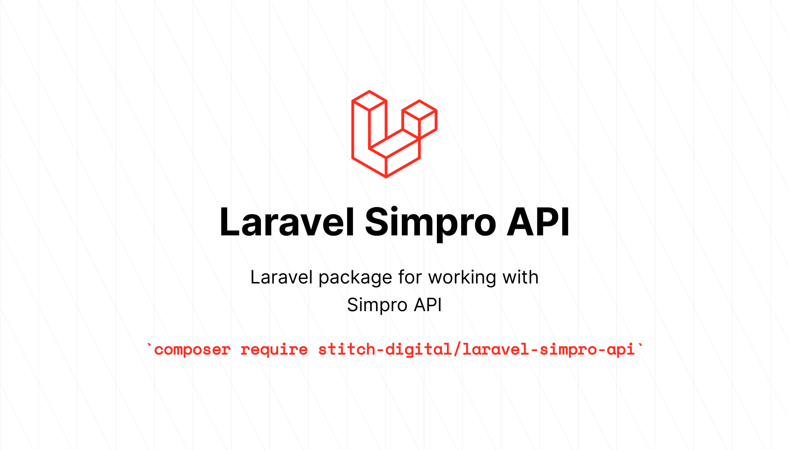

# Laravel package for working with the Simpro API

[](https://packagist.org/packages/stitch-digital/laravel-simpro-api)
[](https://github.com/stitch-digital/laravel-simpro-api/actions?query=workflow%3Arun-tests+branch%3Amain)
[](https://github.com/stitch-digital/laravel-simpro-api/actions?query=workflow%3A"Fix+PHP+code+style+issues"+branch%3Amain)
[](https://packagist.org/packages/stitch-digital/laravel-simpro-api)



Laravel Simpro is a robust package designed to seamlessly integrate your Laravel application with the Simpro API.

The full Simpro API documentation can be [found here](https://developer.simprogroup.com/apidoc/).

## Installation

You can install the package via composer:

```bash
composer require stitch-digital/laravel-simpro-api
```

## Usage

This package is still in development and not all API endpoints are available yet. We are working on this package regularly as we use it for client projects, however until we release a stable version, we recommend you use the [Simpro API documentation](https://developer.simprogroup.com/apidoc/) to make requests directly.

### Testing

```bash
composer test
```

### Todo
- [ ] Requests: Accounting
- [ ] Requests: CustomerAssets
- [ ] Requests: Finance: ContractorInvoices
- [ ] Requests: Finance: CreditNotes
- [ ] Requests: Finance: CustomerPayments
- [ ] Requests: Finance: Invoices
- [ ] Requests: Finance: RecurringInvoices
- [ ] Requests: Finance: RecurringInvoicesCostCentres
- [ ] Requests: Finance: SupplierCredits
- [ ] Requests: Finance: SupplierReceipts
- [x] Requests: Info
- [ ] Requests: Logs
- [ ] Requests: Materials: Catalogues
- [ ] Requests: Materials: Prebuilds
- [ ] Requests: Materials: Stock
- [ ] Requests: Materials: SupplierOrders
- [ ] Requests: Materials: SupplierQuotes
- [ ] Requests: Materials: TakeOffTemplates
- [ ] Requests: People: Contacts
- [ ] Requests: People: Contractors
- [ ] Requests: People: Customers
- [ ] Requests: People: Employees
- [ ] Requests: People: Sites
- [ ] Requests: People: Staff
- [ ] Requests: People: Suppliers
- [ ] Requests: Plant
- [ ] Requests: Projects: ContractorJobs
- [ ] Requests: Projects: JobCostCentres
- [ ] Requests: Projects: Jobs
- [ ] Requests: Projects: Leads
- [ ] Requests: Projects: Quotes
- [ ] Requests: Projects: QuotesCostCentres
- [ ] Requests: Projects: RecurringJobCostCentres
- [ ] Requests: Projects: RecurringJobs
- [ ] Requests: Reports
- [ ] Requests: Schedules
- [ ] Requests: Setup: Accounts
- [ ] Requests: Setup: Activities
- [ ] Requests: Setup: ArchiveReasons
- [ ] Requests: Setup: AssetBuilder
- [ ] Requests: Setup: Commissions
- [ ] Requests: Setup: Currencies
- [ ] Requests: Setup: CustomerGroups
- [ ] Requests: Setup: CustomerProfiles
- [ ] Requests: Setup: CustomFields
- [ ] Requests: Setup: LabourRates
- [ ] Requests: Setup: Materials
- [ ] Requests: Setup: ResponseTimes
- [ ] Requests: Setup: SecurityGroups
- [ ] Requests: Setup: StatusCodes
- [ ] Requests: Setup: Tags
- [ ] Requests: Setup: TaskBuilder
- [ ] Requests: Setup: TaxCodes
- [ ] Requests: Setup: Teams
- [ ] Requests: Setup: WebhookSubscriptions
- [ ] Requests: Setup: Zones
- [ ] Requests: Tasks

### Changelog

Please see [CHANGELOG](CHANGELOG.md) for more information what has changed recently.

## Contributing

Contributions are welcome and will be fully credited! Contributions are accepted via Pull Requests on [Github](https://github.com/stitch-digital/laravel-simpro-api).

### Security

If you discover any security related issues, please email john@stitch-digital.co instead of using the issue tracker.

## Credits

-   [John Trickett](https://github.com/stitch-digital)
-   [All Contributors](../../contributors)

## License

The MIT License (MIT). Please see [License File](LICENSE.md) for more information.
